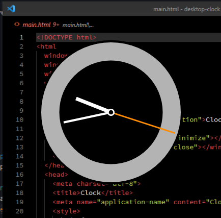

gbraad's Analogue Clock: SVG based desktop clock
================================================

Based on my older project [html5-clock](https://github.com/gbraad-apps/analogue-clock).



This uses Sciter-JS to run a small, resizable, transparent clock omn the desktop.

### Run
```
PS> clock.exe
```

> [!NOTE]
> Sciter SDK can be downloaded from: https://gitlab.com/sciter-engine/sciter-js-sdk/-/releases
